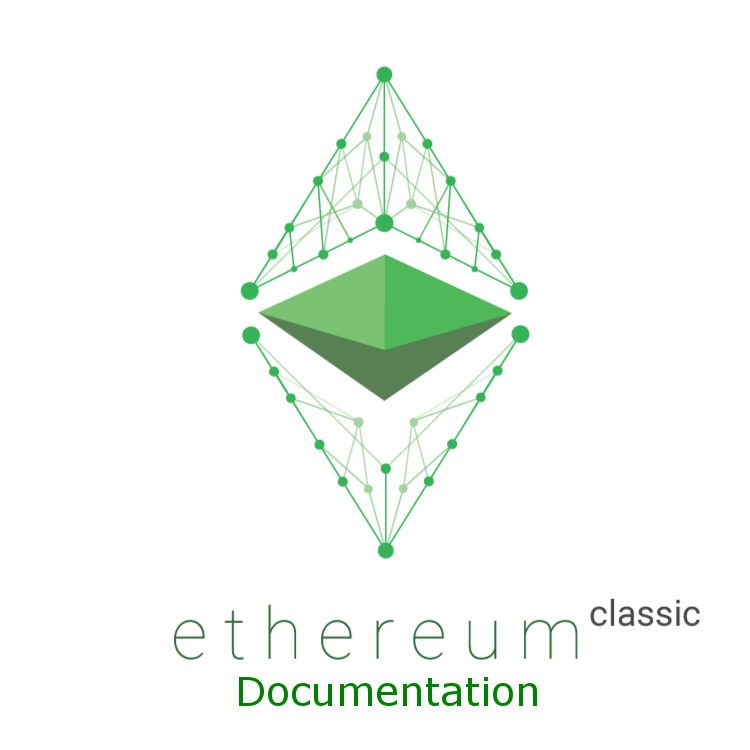

.. Homestead guide documentation master file, created by
   sphinx-quickstart on Tue Jan  5 17:30:05 2016.
   You can adapt this file completely to your liking, but it should at least
   contain the root `toctree` directive. Modification to classic began on Sat Jul 30 07:00:00 2016

Ethereum Classic Documentation
===============================================================================

..   :height: 500px
..   :width: 394 px
   :scale: 50 %
   :alt: ethereum-logo
   :align: center
Welcome, new :ref:`contributors`! This documentation is the result of ongoing 
collaborative effort by volunteers from the Ethereum Classic :ref:`community`.
It has not been authorized by the Ethereum :ref:`Foundation` or any other
centralized authority. We hope you will find it useful. 

Contents
===============================================================================

.. toctree::
   :maxdepth: 4

   introduction/index.rst
   ethereum-clients/index.rst
   account-management.rst
   ether.rst
   network/index.rst
   mining.rst
   contracts-and-transactions/index.rst
   frequently-asked-questions/frequently-asked-questions.rst
   glossary.rst
   about.rst

Improve the Documentation
===============================================================================

See `this page <https://ethereum-homestead.readthedocs.org/en/latest/about.html>`__ to help us improve the documentation.
